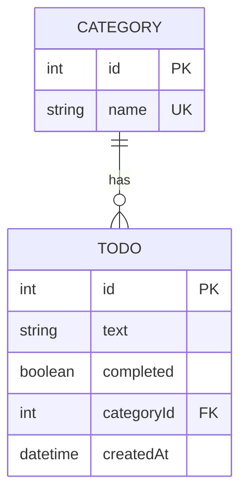
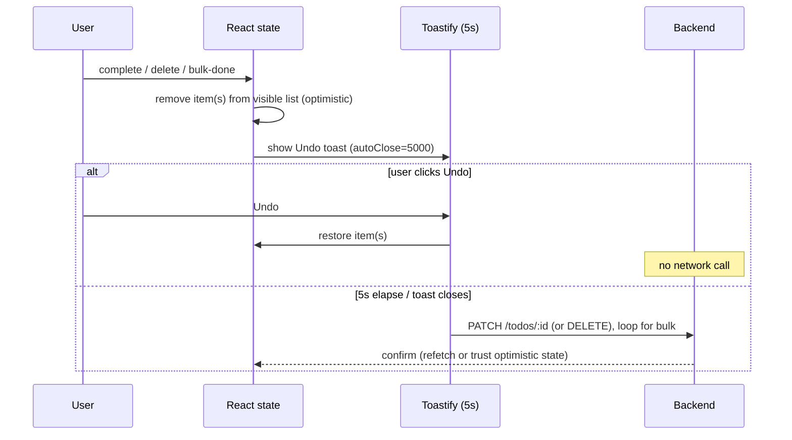

# feat: Todo-with-categories full-stack app

## Summary

Build a small full-stack Todo app with categories in the existing Turborepo. Backend (`apps/backend`) is NestJS + SQLite via TypeORM exposing 5 REST endpoints with a 5-tasks-per-category limit. Frontend (`apps/frontend`) is Next.js 16 App Router, fully client-side, using React Hook Form, Axios, Tailwind, and React Toastify with client-optimistic Undo for complete/delete. Work is organized into 5 slices, each a `ce-work` → `ce-code-review` → `ce-compound` loop. All decisions are locked in the origin spec; this plan sequences the build.

---

## Problem Frame

The repo has an empty Turborepo scaffold (NestJS 11 + Jest configured; Next 16 + React 19; no DB, validation, Tailwind, RHF, Axios, or Toastify yet). The task (`task.md`) asks for a Todo-with-categories app with optimistic Undo, a 5-per-category limit, full UX states, a bulk mark-done action, tests, docker-compose, and deployment to Vercel (frontend) + Railway (backend). The origin spec (`docs/PROJECT_SPEC.md`) resolves all 11 architectural forks. This plan turns that spec into dependency-ordered implementation units.

---

## Requirements Traceability

From `docs/PROJECT_SPEC.md` §2 and `task.md`:

- **R1** — Create task with text + category (`POST /todos`).
- **R2** — View list (text + category + status); render only `completed=false`.
- **R3** — Mark task done via checkbox (optimistic, 5s Undo).
- **R4** — Delete task (optimistic, 5s Undo).
- **R5** — Filter list by category (`GET /todos?category=<id>`; "All" = no param).
- **R6** — Max 5 active tasks per category → `POST` returns `400`.
- **R7** — Complete/delete shows Undo toast, 5s window, then commits.
- **R8** — UX states: loading spinner / error message / empty "No tasks".
- **R9** — Seed categories via `GET /categories`.
- **R10** — Bulk action: select multiple/all, mark done (one batch Undo toast).
- **R11** (bonus) — Jest tests (backend) + RTL tests (frontend).
- **R12** (bonus) — docker-compose for local run.
- **R13** — README (run + deploy instructions + AI Q&A) and live deployment.

---

## Key Technical Decisions

All carried from the origin spec's locked-decisions table (see origin: `docs/PROJECT_SPEC.md` §3). Restated here as the decisions this plan executes against:

- **KTD1 — Client-optimistic Undo, no server soft-delete.** Complete/delete mutate React state + start a 5s timer; the real `PATCH`/`DELETE` fires only on timeout. Undo cancels the timer with no network call. Keeps backend to the 5 spec endpoints.
- **KTD2 — Completed tasks hidden from active list.** `GET /todos` returns all rows; the frontend renders only `completed=false`. One reusable transient pattern serves both complete and delete.
- **KTD3 — 5-limit counts active only.** Backend limit check is `WHERE categoryId=? AND completed=false`, count `>= 5` → `400`. Avoids blocking against invisible completed rows.
- **KTD4 — TypeORM + `synchronize:true`, `better-sqlite3` driver.** Idiomatic NestJS (entities/repositories/DI); no migrations for this scope.
- **KTD5 — Seeded categories, idempotent, no create endpoint.** Seed only if the table is empty.
- **KTD6 — Bulk = one batch toast + one Undo.** Optimistic-remove all selected, single 5s toast; on timeout loop `PATCH /todos/:id`.
- **KTD7 — Local frontend `types.ts`, no shared package.** Avoids cross-builder build wiring for 2-3 interfaces.
- **KTD8 — Fully client-side Axios fetch.** Root page `'use client'`; initial GET on mount; all mutations client-side.
- **KTD9 — Railway + volume backend, `DATABASE_PATH` env.** SQLite file on a mounted volume survives redeploys. CORS via `FRONTEND_URL`; frontend calls backend via `NEXT_PUBLIC_API_URL`.

**`.env` rule (process constraint):** the agent never writes `.env` files. When env vars are needed, propose contents in chat and the user creates the file. `.env.example` templates may be written directly.

---

## High-Level Technical Design

### Data model



### Optimistic Undo flow (complete / delete / bulk)



---

## Output Structure

Expected new files (per-unit `**Files:**` are authoritative):

```
apps/backend/src/
  app.module.ts                 # modified: register TypeORM + feature modules
  main.ts                       # modified: enable CORS + ValidationPipe
  database/
    data-source.ts              # TypeORM config (DATABASE_PATH)
  category/
    category.entity.ts
    category.module.ts
    category.service.ts          # + seed on init
    category.controller.ts
    category.service.spec.ts
  todo/
    todo.entity.ts
    todo.module.ts
    todo.service.ts
    todo.controller.ts
    dto/create-todo.dto.ts
    dto/update-todo.dto.ts
    todo.service.spec.ts
apps/backend/test/
  todos.e2e-spec.ts

apps/frontend/
  tailwind.config.ts            # + postcss config
  app/
    globals.css                 # modified: Tailwind directives
    layout.tsx                  # modified: ToastContainer
    page.tsx                    # modified: renders TodoApp
  lib/
    api.ts                      # Axios client
    types.ts
  hooks/
    useTodos.ts
    useOptimisticRemoval.ts
  components/
    TodoApp.tsx
    TodoList.tsx
    TodoItem.tsx
    CreateTodoForm.tsx
    CategoryFilter.tsx
    BulkActions.tsx
    states/{Spinner,ErrorMessage,EmptyState}.tsx
  __tests__/                    # RTL tests

docker-compose.yml
apps/backend/Dockerfile
apps/frontend/Dockerfile
README.md                       # modified
```

---

## Implementation Units

Each unit is one slice = one `ce-work` → `ce-code-review` → `ce-compound` loop.

### U1. Scaffold + shared foundation

**Goal:** Install all dependencies and wire the DB + entities + seed + frontend libraries so both apps boot with the data layer live.

**Requirements:** R9 (categories endpoint reachable), foundation for all others.

**Dependencies:** none.

**Files:**
- `apps/backend/package.json` (add `@nestjs/typeorm`, `typeorm`, `better-sqlite3`, `class-validator`, `class-transformer`, `@nestjs/config`)
- `apps/backend/src/database/data-source.ts` (create)
- `apps/backend/src/category/category.entity.ts` (create)
- `apps/backend/src/todo/todo.entity.ts` (create)
- `apps/backend/src/category/category.service.ts` (create — seed logic)
- `apps/backend/src/category/category.module.ts`, `category.controller.ts` (create)
- `apps/backend/src/app.module.ts` (modify — register TypeORM + modules)
- `apps/backend/src/main.ts` (modify — CORS + global ValidationPipe)
- `apps/frontend/package.json` (add `axios`, `react-hook-form`, `react-toastify`, `tailwindcss`, `postcss`, `autoprefixer`; dev: `@testing-library/react`, `@testing-library/jest-dom`, `@testing-library/user-event`, `jest`/`jest-environment-jsdom` or Vitest per react-testing skill)
- `apps/frontend/tailwind.config.ts`, `postcss.config.mjs` (create)
- `apps/frontend/app/globals.css` (modify — Tailwind directives)
- `apps/frontend/lib/types.ts` (create — `Todo`, `Category`, DTO shapes)

**Approach:** TypeORM `forRoot` with `type: 'better-sqlite3'`, `database: process.env.DATABASE_PATH ?? './data/db.sqlite'`, `synchronize: true`, `autoLoadEntities: true`. `CategoryService.onModuleInit` seeds Work/Personal/Shopping/Health only if `count() === 0`. `main.ts` enables CORS for `process.env.FRONTEND_URL` and registers `ValidationPipe({ whitelist: true, transform: true })`. Frontend `types.ts` mirrors the API contract (KTD7).

**Patterns to follow:** existing `app.module.ts` / `main.ts` Nest bootstrap; `nestjs-patterns` skill for module structure; `tailwindcss` skill for v4 setup.

**Test scenarios:**
- `Test expectation: none` — scaffolding/config only. Verification is boot + seed, covered below. (Seed correctness is exercised by U2's service tests.)

**Verification:** `pnpm --filter backend dev` boots without errors; `GET /categories` returns the 4 seeded categories; restarting does not duplicate seeds; `pnpm --filter frontend dev` compiles with Tailwind classes applying.

**`.env` note:** before this unit runs, propose backend `.env` (`DATABASE_PATH`, `FRONTEND_URL`, `PORT`) and frontend `.env.local` (`NEXT_PUBLIC_API_URL`) in chat for the user to create; write `.env.example` templates directly.

---

### U2. Backend API + validation + 5-limit + tests

**Goal:** Implement all 5 endpoints with DTO validation, the active-only 5-per-category limit, proper error codes, and Jest coverage.

**Requirements:** R1, R2, R5, R6, R9; R11 (backend tests).

**Dependencies:** U1.

**Files:**
- `apps/backend/src/todo/dto/create-todo.dto.ts` (create — `text` `@IsString @IsNotEmpty @MaxLength(200)`, `categoryId` `@IsInt`)
- `apps/backend/src/todo/dto/update-todo.dto.ts` (create — `completed` `@IsBoolean`)
- `apps/backend/src/todo/todo.service.ts` (create)
- `apps/backend/src/todo/todo.controller.ts` (create)
- `apps/backend/src/todo/todo.module.ts` (create)
- `apps/backend/src/category/category.controller.ts` (GET list)
- `apps/backend/src/todo/todo.service.spec.ts` (create)
- `apps/backend/src/category/category.service.spec.ts` (create — seed idempotency)
- `apps/backend/test/todos.e2e-spec.ts` (create)

**Approach:** `TodoService.create` checks category exists (else `400`) and active count `< 5` (KTD3) before insert, else throws `BadRequestException` with a clear message. `findAll(categoryId?)` filters by `categoryId` when present (KTD11). `update` toggles `completed`, throws `NotFoundException` if missing. `remove` hard-deletes, `404` if missing. Controller maps routes to the spec contract. Reuse default Nest exception filter for status codes.

**Patterns to follow:** `nestjs-patterns` (service/controller/DTO split, repository injection); `jest` skill for spec structure; existing `app.e2e-spec.ts` for e2e bootstrap with supertest.

**Test scenarios:**
- Happy: `create` with valid text+categoryId persists and returns the todo. Covers R1.
- Happy: `findAll()` returns all; `findAll(categoryId)` returns only that category. Covers R5.
- Happy: `update(id, {completed:true})` flips status; `update` back to false works. Covers R2/R3.
- Happy: `remove(id)` deletes the row. Covers R4.
- Edge: 5th active task in a category succeeds; **6th active returns 400**. Covers R6.
- Edge: limit ignores completed rows — category with 5 completed + 0 active accepts a new task. Covers KTD3.
- Error: `create` with missing/blank text → `400` (validation). Covers R6 validation.
- Error: `create` with non-existent categoryId → `400`.
- Error: `text` over 200 chars → `400`.
- Error: `update`/`delete` non-existent id → `404`.
- Integration (e2e): full `POST` → `GET` → `PATCH` → `DELETE` sequence over HTTP returns correct statuses and bodies; 6th-in-category POST returns `400` with message.
- Service: seed runs once — calling `onModuleInit` twice keeps category count at 4.

**Verification:** `pnpm --filter backend test` and `test:e2e` green; manual `curl`/REST of each endpoint matches the contract incl. `400` on the 6th task.

---

### U3. Frontend core — list, create form, Axios, states

**Goal:** Client-side app that loads and lists active todos, creates todos via a React Hook Form, and shows loading/error/empty states.

**Requirements:** R1, R2, R8, R9 (consume categories); KTD8.

**Dependencies:** U2 (live API).

**Files:**
- `apps/frontend/lib/api.ts` (create — Axios instance with `baseURL: NEXT_PUBLIC_API_URL`)
- `apps/frontend/hooks/useTodos.ts` (create — fetch todos + categories, loading/error)
- `apps/frontend/components/TodoApp.tsx` (create — orchestrator, `'use client'`)
- `apps/frontend/components/TodoList.tsx`, `TodoItem.tsx` (create)
- `apps/frontend/components/CreateTodoForm.tsx` (create — RHF)
- `apps/frontend/components/states/Spinner.tsx`, `ErrorMessage.tsx`, `EmptyState.tsx` (create)
- `apps/frontend/app/page.tsx` (modify — render `TodoApp`)
- `apps/frontend/app/layout.tsx` (modify — `ToastContainer` mount)

**Approach:** `useTodos` fetches `/todos` + `/categories` on mount, exposes `{todos, categories, loading, error, refetch, setTodos}`. `TodoApp` renders Spinner while loading, ErrorMessage on failure, EmptyState when no active todos, else `TodoList`. `TodoList` filters to `completed=false` (KTD2). `CreateTodoForm` uses `useForm` (text input + category `<select>`); on submit `POST /todos`, on success refetch/prepend, on `400` show the backend message via toast + inline error (RHF `setError`). Render only active todos.

**Patterns to follow:** `react-hook-form` skill (`useForm`, `handleSubmit`, validation); `nextjs-app-router-patterns` for client component boundaries; `tailwindcss` for styling.

**Test scenarios:** (deferred to U4 alongside interaction tests to keep one RTL setup; this unit's verification is manual + covered by U4 RTL.)
- `Test expectation: covered in U4` — component render/interaction tests batched with the RTL harness in U4.

**Verification:** against the running backend: list shows seeded-category todos; creating a task adds it; submitting into a full category surfaces the `400` message; loading shows spinner, empty list shows "No tasks", killing the backend shows the error state.

---

### U4. Undo + filter + bulk + RTL tests

**Goal:** Optimistic complete/delete with 5s Undo toast, category filter, bulk mark-done, and React Testing Library coverage for the interactive behavior.

**Requirements:** R3, R4, R5, R7, R10; R11 (frontend tests); KTD1, KTD2, KTD6.

**Dependencies:** U3.

**Files:**
- `apps/frontend/hooks/useOptimisticRemoval.ts` (create — generic optimistic-remove + 5s timer + Undo)
- `apps/frontend/components/TodoItem.tsx` (modify — checkbox complete + delete button)
- `apps/frontend/components/CategoryFilter.tsx` (create — select above list)
- `apps/frontend/components/BulkActions.tsx` (create — select-all/multi + "Mark done")
- `apps/frontend/components/TodoList.tsx` (modify — selection state, checkboxes)
- `apps/frontend/components/TodoApp.tsx` (modify — wire filter + bulk + optimistic hook)
- `apps/frontend/__tests__/CreateTodoForm.test.tsx` (create)
- `apps/frontend/__tests__/optimistic-undo.test.tsx` (create)
- `apps/frontend/__tests__/CategoryFilter.test.tsx` (create)
- `apps/frontend/__tests__/BulkActions.test.tsx` (create)

**Approach:** `useOptimisticRemoval` removes item(s) from visible state, starts a 5s timer, shows a Toastify toast with an Undo button (`autoClose=5000`); Undo clears the timer and restores; timeout fires the committed action (`PATCH` for complete, `DELETE` for delete; loop `PATCH` for bulk per KTD6). Single batch toast for bulk. `CategoryFilter` re-fetches via `GET /todos?category=<id>` ("All" = no param, KTD11). Use fake timers in tests to assert the 5s boundary.

**Execution note:** implement `useOptimisticRemoval` test-first — the timer/Undo race is the highest-risk logic in the app.

**Patterns to follow:** `react-testing` skill (preferred Vitest browser mode or RTL + user-event); `react-hook-form` for form test wrapper.

**Test scenarios:**
- Happy: completing a todo removes it from the visible list immediately and shows an Undo toast. Covers R3/R7.
- Happy: clicking Undo within 5s restores the todo and fires no network call. Covers R7/KTD1.
- Happy: after 5s with no Undo, the commit action (`PATCH`/`DELETE`) is called once. Covers R7.
- Happy: deleting behaves identically to completing for the transient flow. Covers R4.
- Happy: selecting a category filters the list; "All" restores the full list. Covers R5.
- Happy: bulk-select 3 todos + "Mark done" removes all 3, shows one toast; Undo restores all 3; timeout fires 3 `PATCH` calls. Covers R10/KTD6.
- Edge: rapid complete of two items shows independent timers/toasts and commits both.
- Edge: create form — submitting empty text shows RHF validation error, no API call. Covers R1 validation.
- Error: create into a full category shows the backend `400` message. Covers R6.
- Integration: completed todos never appear in the active list even before commit (state filter). Covers KTD2.

**Verification:** `pnpm --filter frontend test` green; manual: Undo restores, ignoring the toast commits, filter narrows, bulk marks selected done with one toast.

---

### U5. Polish + docker-compose + README + deploy

**Goal:** Containerize for local run, document setup/deploy/AI-usage, and deploy frontend to Vercel + backend to Railway with a persistent volume.

**Requirements:** R12 (docker-compose), R13 (README + live deploy); KTD9.

**Dependencies:** U2, U4 (working app).

**Files:**
- `apps/backend/Dockerfile` (create — multi-stage Node build, volume mount point for SQLite)
- `apps/frontend/Dockerfile` (create — Next standalone build)
- `docker-compose.yml` (create — backend + volume, frontend; wire `NEXT_PUBLIC_API_URL`/`FRONTEND_URL`/`DATABASE_PATH`)
- `README.md` (modify — run locally, docker-compose, deploy steps, env vars, AI Q&A answers from `task.md` §"Answer on Questions")
- `apps/backend/package.json` (verify `start:prod` for container)
- Railway config: persistent volume mounted at the `DATABASE_PATH` dir.

**Approach:** Compose brings up both apps with one command; SQLite file lives on a named volume so local data persists (mirrors KTD9 prod behavior). README covers local (`pnpm dev`), docker-compose, and deploy: Vercel project rooted at `apps/frontend` with `NEXT_PUBLIC_API_URL`; Railway service rooted at `apps/backend` with a volume + `DATABASE_PATH`/`FRONTEND_URL`. Cut docker-compose first if time-constrained (it's a bonus and deploy does not depend on it).

**Patterns to follow:** `docker-patterns` skill (multi-stage, non-root, volumes); Turborepo monorepo deploy conventions (set service root dir).

**Test scenarios:**
- `Test expectation: none` — infra/docs. Verification is the running stack + live URLs below.

**Verification:** `docker compose up` serves frontend talking to backend with persistent data across restarts; Vercel URL loads and talks to the Railway backend (CORS passes); creating a task on the live site persists across a backend redeploy; README steps reproduce a clean run.

**`.env` note:** propose all deploy env vars (Vercel `NEXT_PUBLIC_API_URL`; Railway `DATABASE_PATH`, `FRONTEND_URL`, `PORT`) in chat; the user sets them in the hosting dashboards. Provide `.env.example` files for local reference.

---

## Scope Boundaries

### In scope
- 5 REST endpoints, 5-per-category active limit, optimistic Undo, filter, bulk mark-done, UX states, Jest + RTL tests, docker-compose, Vercel + Railway deploy, README.

### Out of scope (non-goals)
- Auth / users.
- Category CRUD (create/edit/delete categories).
- Server-side undo / soft-delete / audit history.
- Pagination, search.
- Shared types package.

### Deferred to follow-up work
- Cleanup of accumulated completed rows in the DB (acceptable to grow for this scope; note as known limitation in README).
- Bulk-action partial-failure recovery beyond an error toast.

---

## Risks & Dependencies

- **R-A — `better-sqlite3` native build on Railway/Docker.** Native module needs build tooling in the container. Mitigation: use an official Node image with build-essential in the build stage; verify in U5. Fallback: TypeORM `sqlite3` driver.
- **R-B — Optimistic Undo timer races (rapid actions, unmount).** Highest-risk logic. Mitigation: test-first `useOptimisticRemoval` (U4 execution note), clear timers on unmount.
- **R-C — Next 16 / React 19 + RTL tooling maturity.** Test runner setup may need Vitest browser mode (per `react-testing` skill) rather than classic Jest+jsdom. Mitigation: resolve runner choice in U1 deps; treat as execution-time decision.
- **R-D — CORS / env wiring across Vercel ↔ Railway.** Mitigation: `FRONTEND_URL` allowlist + `NEXT_PUBLIC_API_URL` verified in U5; surface env contents in chat per the `.env` rule.
- **R-E — Lost mutations if tab closes during the 5s window.** Accepted trade-off of KTD1 (client-optimistic). Note in README.

---

## Sources & Research

- `docs/PROJECT_SPEC.md` — origin spec, 11 locked decisions, data model, API contract.
- `task.md` — original task, evaluation criteria, AI Q&A.
- Codebase scan: NestJS 11 + Jest configured (`apps/backend`), Next 16 + React 19 (`apps/frontend`), empty scaffold; frontend dev port 3001.
- Skills routed per `CLAUDE.md §5`: `nestjs-patterns`/`nestjs-expert`/`sqlite-expert`, `nextjs-app-router-patterns`/`nextjs-best-practices`/`react-hook-form`/`tailwindcss`, `jest`/`react-testing`, `docker-patterns`.
